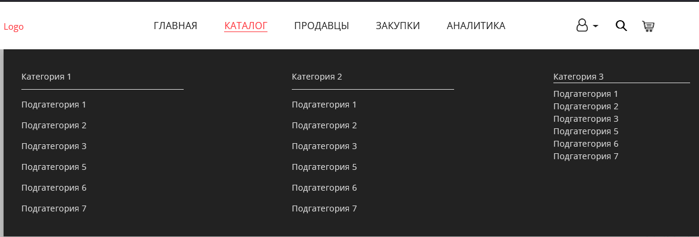
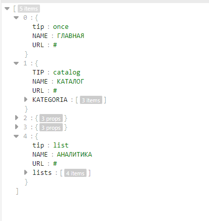

# Наименование проекта

Тестовое задание

## Вводное

_Компьютерная версия_


<br>

_Мобильная версия_


При изменении ширины экрана пропадают пункты меню сайта, а при сильно маленьком значении могут пропадать значки (Человечек/Лупа/Корзина).

<br>




Неккоретно отображается последний столбец

## Задание


1) Необходимо сделать минималистичное и красивое отображение меню сайта, под мобильные устройства
2) Исправить пропадание значков при изменении ширины экрана (Человечек/Лупа/Корзина)
3) В меню, в разделе "Каталог", исправить отображение последней категории. Нужно что было так же, как и у первых двух.
4) В файле _**menu.json**_ содержится массив для построения меню сайта. Сейчас в index.php меню формируется статично. Необходимо с помощью PHP считывать файл menu.json и сформировать меню по данным из этого файла.


## Дополнительно
В файле **menu.json** построение меню сайта зависит от параметра **"tip"**
```
1) once - обычый url (Как у "Главная")
2) catalog - Элемент формата "Каталог" (Как у "Каталог")
3) list - Выпадающий список (Как у "Аналитика")
```

